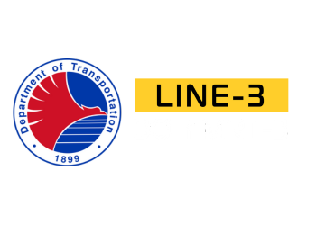

 

# Technical Training Management System (TTMS)

## About

TTMS is a web system designed for the DOTr-MRT3 Training Section. This System can be a valuable tool for organizations looking to enhance the training processes and improve overall efficiency. By automating manual tasks, ensuring compliance, and enabling continuous improvement.

### Benefits

- Centralized Training Data
- Automated Processes
- Compliance Management
- Enhanced Training Effectiveness
- Cost Savings
